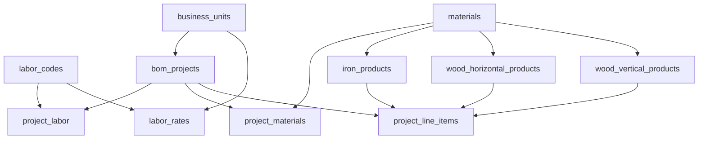

# BOM Calculator Database Documentation

## Overview

This database schema supports **two distinct calculators**:

1. **SKU Builder Calculator**: Creates product definitions with standard costs
2. **Project Calculator**: Multi-SKU estimates with project-level aggregation

## Key Design Principles

### 1. Labor Rates Structure
Labor rates are determined by a **three-level hierarchy**:

```
Business Unit (BU)
  ↓ Location + Client Type (ATX-RES, SA-HB, HOU-RES, etc.)
  ↓
Activity Type + Product Type + Post Type
  ↓ W03 (Wood posts), M03 (Steel posts), IR01 (Iron)
  ↓
Rate ($/unit)
  ↓ $2.00/LF, $2.25/LF, $1.75/LF, etc.
```

**Example:**
- Labor Code: `W03` (Nail Up - Vertical up to 6')
- Business Unit: `ATX-RES` (Austin Residential)
- Rate: `$2.00/LF`

- Same Labor Code: `W03`
- Business Unit: `ATX-HB` (Austin Home Builder)
- Rate: `$1.65/LF` (different rate!)

### 2. Decimal vs Integer Storage

**Project Line Items** store calculations as **decimals** (before rounding):
```sql
calculated_posts DECIMAL(10,2) -- 14.23 posts (not rounded)
```

**Project Materials** store both:
```sql
calculated_quantity DECIMAL(10,2) -- 21.47 (sum of line items)
rounded_quantity INTEGER -- 22 (project-level rounding)
manual_quantity INTEGER -- 25 (user override)
final_quantity INTEGER -- 25 (uses manual if set, else rounded)
```

**Why?** Prevents cumulative rounding errors when aggregating multiple line items.

### 3. Post Type Determines Labor Codes

**CRITICAL:** The `post_type` field determines which labor codes apply:

| Post Type | Labor Codes | Usage |
|-----------|-------------|-------|
| WOOD | W03, W04, W06, W07 | Wood post fences (A01, B01 series) |
| STEEL | M03, M04, M06, M07 | Steel post fences (C01, D01 series) |

**Example:**
- SKU A01: `post_type='WOOD'` → Uses `W03` (Nail Up)
- SKU C01: `post_type='STEEL'` → Uses `M03` (Steel Nail Up)

Even though both are 6' Wood Vertical fences!

## Table Relationships



## Usage Examples

### Creating a New SKU (SKU Builder)

```sql
-- 1. Insert the product definition
INSERT INTO wood_vertical_products (
  sku_code, sku_name, height, rail_count, post_type, style, post_spacing,
  post_material_id, picket_material_id, rail_material_id
) VALUES (
  'A01',
  '6'' Ver 1x6 : 2R : WOOD Post',
  6,  -- height in feet
  2,  -- number of rails
  'WOOD',  -- CRITICAL: determines labor codes!
  'Standard',
  8.0,  -- post spacing in feet
  (SELECT id FROM materials WHERE material_sku = 'PS13'),  -- 4x4 PTP 8ft
  (SELECT id FROM materials WHERE material_sku = 'P601'),  -- 1x6 Sierra Placer
  (SELECT id FROM materials WHERE material_sku = 'RA01')   -- 2x4 SPF
);

-- 2. Calculate standard cost (SKU Builder Calculator)
-- This would be done programmatically using formulas from 02-BUSINESS_LOGIC.md
-- Result is cached in the product record:
UPDATE wood_vertical_products
SET
  standard_material_cost = 1200.00,
  standard_labor_cost = 400.00,
  standard_cost_per_foot = 16.00,
  standard_cost_calculated_at = NOW()
WHERE sku_code = 'A01';
```

### Creating a Project Estimate

```sql
-- 1. Create project
INSERT INTO bom_projects (
  project_name, customer_name, business_unit_id, concrete_type
) VALUES (
  'Smith Backyard Fence',
  'John Smith',
  (SELECT id FROM business_units WHERE code = 'ATX-RES'),
  '3-part'
) RETURNING id;
-- Returns: '123e4567-e89b-12d3-a456-426614174000'

-- 2. Add line items
INSERT INTO project_line_items (
  project_id, fence_type, product_id, product_sku_code, product_name,
  total_footage, buffer, net_length, number_of_lines, number_of_gates,
  calculated_posts, calculated_pickets, calculated_rails, sort_order
) VALUES
  -- Line 1: 100ft of A01
  (
    '123e4567-e89b-12d3-a456-426614174000',
    'wood_vertical',
    (SELECT id FROM wood_vertical_products WHERE sku_code = 'A01'),
    'A01',
    '6'' Ver 1x6 : 2R : WOOD Post',
    105.0,  -- total footage with buffer
    5.0,    -- buffer
    100.0,  -- net length
    1,      -- lines
    1,      -- gates
    14.25,  -- calculated posts (DECIMAL!)
    229.4,  -- calculated pickets
    26.0,   -- calculated rails
    1
  ),
  -- Line 2: 50ft of C04 (steel posts)
  (
    '123e4567-e89b-12d3-a456-426614174000',
    'wood_vertical',
    (SELECT id FROM wood_vertical_products WHERE sku_code = 'C04'),
    'C04',
    '6'' Ver 1x6 : 3R : STEEL Post',
    55.0,
    5.0,
    50.0,
    1,
    0,
    7.125,  -- calculated posts (DECIMAL!)
    114.7,  -- calculated pickets
    19.5,   -- calculated rails
    2
  );

-- 3. Aggregate materials (would be done programmatically)
INSERT INTO project_materials (
  project_id, material_id, calculated_quantity, rounded_quantity
) VALUES
  -- Wood posts from Line 1: 14.25
  (
    '123e4567-e89b-12d3-a456-426614174000',
    (SELECT id FROM materials WHERE material_sku = 'PS13'),
    14.25,  -- calculated (decimal)
    15      -- rounded (integer)
  ),
  -- Steel posts from Line 2: 7.125
  (
    '123e4567-e89b-12d3-a456-426614174000',
    (SELECT id FROM materials WHERE material_sku = 'PS04'),
    7.125,
    8
  ),
  -- Pickets aggregated: 229.4 + 114.7 = 344.1
  (
    '123e4567-e89b-12d3-a456-426614174000',
    (SELECT id FROM materials WHERE material_sku = 'P601'),
    344.1,  -- sum of both line items (DECIMAL)
    345     -- rounded at project level (INTEGER)
  );

-- 4. Calculate concrete based on TOTAL posts (15 + 8 = 23)
INSERT INTO project_materials (
  project_id, material_id, calculated_quantity, rounded_quantity, aggregation_level
) VALUES
  -- CTS: Math.ceil(23/10) = 3
  (
    '123e4567-e89b-12d3-a456-426614174000',
    (SELECT id FROM materials WHERE material_sku = 'CTS'),
    2.3,
    3,
    'project'
  ),
  -- CTP: Math.ceil(23/20) = 2
  (
    '123e4567-e89b-12d3-a456-426614174000',
    (SELECT id FROM materials WHERE material_sku = 'CTP'),
    1.15,
    2,
    'project'
  ),
  -- CTQ: 23 × 0.5 = 11.5
  (
    '123e4567-e89b-12d3-a456-426614174000',
    (SELECT id FROM materials WHERE material_sku = 'CTQ'),
    11.5,
    12,
    'project'
  );

-- 5. Add labor (different codes for wood vs steel posts!)
INSERT INTO project_labor (
  project_id, labor_code_id, calculated_quantity, labor_rate
) VALUES
  -- W02: Set posts for Line 1 (wood posts)
  (
    '123e4567-e89b-12d3-a456-426614174000',
    (SELECT id FROM labor_codes WHERE labor_sku = 'W02'),
    100.0,  -- net length
    (SELECT rate FROM labor_rates
     WHERE labor_code_id = (SELECT id FROM labor_codes WHERE labor_sku = 'W02')
     AND business_unit_id = (SELECT id FROM business_units WHERE code = 'ATX-RES'))
  ),
  -- W03: Nail up for Line 1 (wood posts, up to 6ft)
  (
    '123e4567-e89b-12d3-a456-426614174000',
    (SELECT id FROM labor_codes WHERE labor_sku = 'W03'),
    100.0,
    (SELECT rate FROM labor_rates
     WHERE labor_code_id = (SELECT id FROM labor_codes WHERE labor_sku = 'W03')
     AND business_unit_id = (SELECT id FROM business_units WHERE code = 'ATX-RES'))
  ),
  -- M03: Nail up for Line 2 (STEEL posts, up to 6ft) - DIFFERENT CODE!
  (
    '123e4567-e89b-12d3-a456-426614174000',
    (SELECT id FROM labor_codes WHERE labor_sku = 'M03'),
    50.0,
    (SELECT rate FROM labor_rates
     WHERE labor_code_id = (SELECT id FROM labor_codes WHERE labor_sku = 'M03')
     AND business_unit_id = (SELECT id FROM business_units WHERE code = 'ATX-RES'))
  );
```

### Manual Overrides at Project Level

```sql
-- User wants 30 posts instead of calculated 22
UPDATE project_materials
SET manual_quantity = 30
WHERE project_id = '123e4567-e89b-12d3-a456-426614174000'
AND material_id = (SELECT id FROM materials WHERE material_sku = 'PS13');

-- The final_quantity generated column automatically uses manual_quantity:
SELECT
  m.material_sku,
  pm.calculated_quantity,
  pm.rounded_quantity,
  pm.manual_quantity,
  pm.final_quantity  -- Will be 30
FROM project_materials pm
JOIN materials m ON pm.material_id = m.id
WHERE pm.project_id = '123e4567-e89b-12d3-a456-426614174000';
```

### Adding Custom Materials to a Project

```sql
-- User adds extra trim boards not in the SKU definition
INSERT INTO project_materials (
  project_id, material_id, calculated_quantity, rounded_quantity,
  is_manual_addition, calculation_note
) VALUES (
  '123e4567-e89b-12d3-a456-426614174000',
  (SELECT id FROM materials WHERE material_sku = 'CTN07'),  -- 1x4x8 Cedar Trim
  0,     -- no calculated quantity
  5,     -- user manually added 5
  true,  -- flag as manual addition
  'Customer requested extra trim for front gate'
);
```

## Important Queries

### Get Labor Rate for Specific BU and Code

```sql
SELECT
  lc.labor_sku,
  lc.description,
  bu.code as business_unit,
  lr.rate,
  lc.unit_type
FROM labor_rates lr
JOIN labor_codes lc ON lr.labor_code_id = lc.id
JOIN business_units bu ON lr.business_unit_id = bu.id
WHERE lc.labor_sku = 'W03'
  AND bu.code = 'ATX-RES';
```

### Get All Materials for a SKU

```sql
SELECT
  'post' as component_type,
  m.material_sku,
  m.material_name,
  m.actual_width,
  m.unit_cost
FROM wood_vertical_products wv
JOIN materials m ON wv.post_material_id = m.id
WHERE wv.sku_code = 'A01'

UNION ALL

SELECT
  'picket' as component_type,
  m.material_sku,
  m.material_name,
  m.actual_width,
  m.unit_cost
FROM wood_vertical_products wv
JOIN materials m ON wv.picket_material_id = m.id
WHERE wv.sku_code = 'A01'

UNION ALL

SELECT
  'rail' as component_type,
  m.material_sku,
  m.material_name,
  m.actual_width,
  m.unit_cost
FROM wood_vertical_products wv
JOIN materials m ON wv.rail_material_id = m.id
WHERE wv.sku_code = 'A01';
```

### Get Project Summary

```sql
SELECT
  p.project_name,
  p.customer_name,
  bu.name as business_unit,
  p.total_linear_feet,
  p.total_material_cost,
  p.total_labor_cost,
  p.total_project_cost,
  p.cost_per_foot,
  COUNT(DISTINCT pli.id) as line_item_count,
  COUNT(DISTINCT pm.id) as material_count,
  COUNT(DISTINCT pl.id) as labor_count
FROM bom_projects p
JOIN business_units bu ON p.business_unit_id = bu.id
LEFT JOIN project_line_items pli ON p.id = pli.project_id
LEFT JOIN project_materials pm ON p.id = pm.project_id
LEFT JOIN project_labor pl ON p.id = pl.project_id
WHERE p.id = '123e4567-e89b-12d3-a456-426614174000'
GROUP BY p.id, bu.name;
```

## Migration Steps

1. **Run schema**: Execute `01_schema.sql` in Supabase SQL Editor
2. **Seed reference data**: Execute `02_seed_business_units.sql`, `03_seed_materials.sql`, `04_seed_labor.sql`
3. **Import SKUs**: Execute `05_seed_products.sql` (converted from CSV)
4. **Test calculations**: Create test projects and verify formulas

## Next Steps

- [ ] Create seed data SQL files from CSV exports
- [ ] Build TypeScript types matching this schema
- [ ] Implement FenceCalculator class with formulas from 02-BUSINESS_LOGIC.md
- [ ] Build UI components for SKU Builder
- [ ] Build UI components for Project Calculator
- [ ] Add Row Level Security (RLS) policies
- [ ] Add database functions for common calculations
